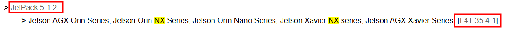
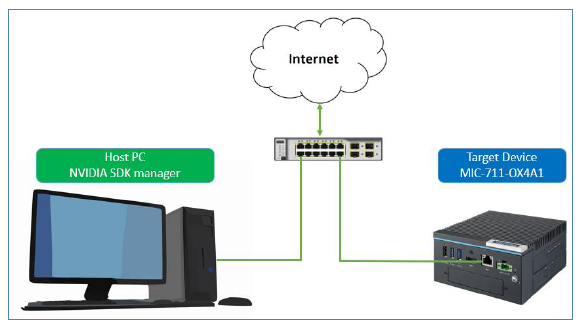
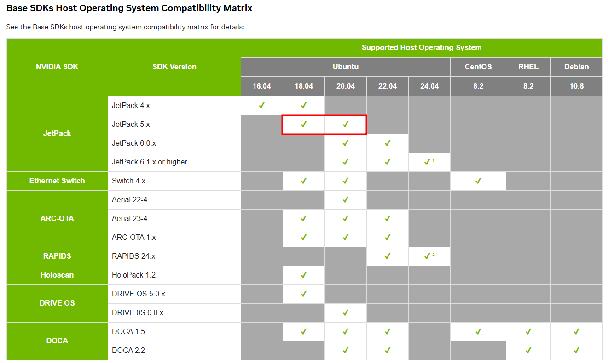

# Jetson Orin NX Introduction

## Linux for Tegra (L4T)

- **Jetson Orin NX** operates based on **L4T (Linux for Tegra)**.
- **Tegra** is a System on Chip (SoC) integrating ARM CPU, GPU, northbridge, southbridge, and memory controller within a single package.

### Checking Versions

- **L4T Version:**
```bash
dpkg-query --show nvidia-l4t-core
# Output example:
# nvidia-l4t-core 35.4.1-20230801124926
```

- **Tegra Version:**
```bash
cat /etc/nv_tegra_release
# Output example:
# # R35 (release), REVISION: 4.1, GCID: 33958178, BOARD: t186ref, EABI: aarch64, DATE: Tue Aug 1 19:57:35 UTC 2023
```

### JetPack Version

- According to the [NVIDIA JetPack Archive](https://developer.nvidia.com/embedded/jetpack-archive), the corresponding JetPack version for L4T 35.4.1 is **JetPack 5.1.2**.



### Installing JetPack SDK

- For L4T version 36.2 or newer, use Advanced Package Tool (**APT**); for earlier versions (like 35.4.1), use **SDK Manager**.
- Therefore, we will use the **SDK Manager** to install JetPack 5.1.2.



### Compatible Host PC Operating Systems

- Based on JetPack 5.1.2, the compatible host PC operating system versions are:
  - **Ubuntu 18.04**
  - **Ubuntu 20.04**

  
*(Source from [SDK Manager](https://developer.nvidia.com/sdk-manager))*
