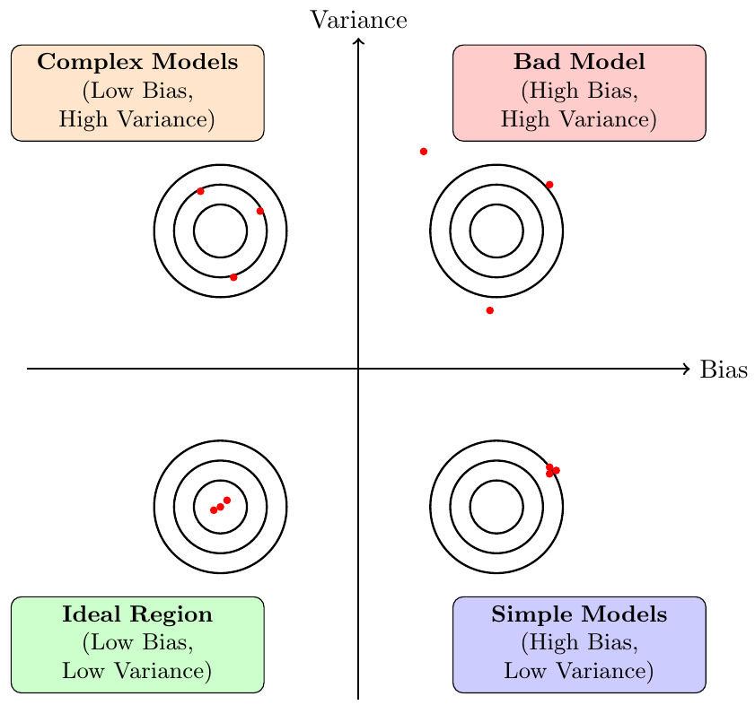

# Lecture 2: Where Does the Error Come From?
---

### 1. Two Types of Errors
- **Bias**: How far the model's predictions are from the true values.
- **Variance**: How scattered or inconsistent the model's predictions are.

---

### 2. Bias-Variance Relationship

---

### 3. How to Handle Errors?

#### 3.1 **Large Variance**:
A model with large variance is overfitting, meaning it fits the training data too closely but fails to generalize to new (testing) data.

- **Solutions**:
  - **Collect More Data**:
    Collecting more data is very effective in reducing variance and typically does not increase bias. However, it may not always be feasible to collect additional data in real-world situations.
  
  - **Data Augmentation**:
    Data augmentation helps to reduce variance by artificially expanding the dataset. Common methods include:
    - Rotating images
    - Adding noise
    - Changing voice characteristics (e.g., converting male voices to female voices)
    - Translating text between languages

  - **Regularization**:
    Regularization reduces variance by restricting the complexity of the model's hypothesis space to smoother functions *(see Lecture 1)*. However, overly aggressive regularization might increase bias.

#### 3.2 **Large Bias**:
A model with large bias is underfitting, meaning it cannot adequately fit even the training data.

- **Solutions**:
Redesign the model architecture
  - **Add more input features**
  - **Increase the complexity of the model**

---

### 4. Model Selection

- There is usually a trade-off between bias and variance.
- Our goal is to select a model that **balances bias and variance** to **minimize the total error**.

- **Two methods for model selection**:
  
  #### Select by the Training Set:
  - Find the model with the lowest error on the testing set.
  - Although intuitive, this approach is unreliable because it usually leads to high variance.

  #### Select by Cross-Validation (Recommended):
  - Separate the training set into two subsets:
    - **Training subset**: used for model training.
    - **Validation subset**: used for model evaluation and selection.

  - Train models on the training subset and select the one with the lowest validation error.
  - After selection, retrain the chosen model on the entire original training set to finalize it.

  - ***Important***: It is not recommended to tune the model based on testing data results, as this introduces bias and invalidates the testing set.

  #### N-fold Cross-Validation:
  - To further avoid bias from validation data, use **N-fold cross-validation**:
    - Split the training set into **N equal parts**.
    - Train the model **N times**, each time using **N-1 parts** for training and the remaining part for validation.
    - Compute the average error across all N runs.
    - Choose the model with the lowest average validation error.
  - Retrain the selected model on the entire original training set to finalize it.

