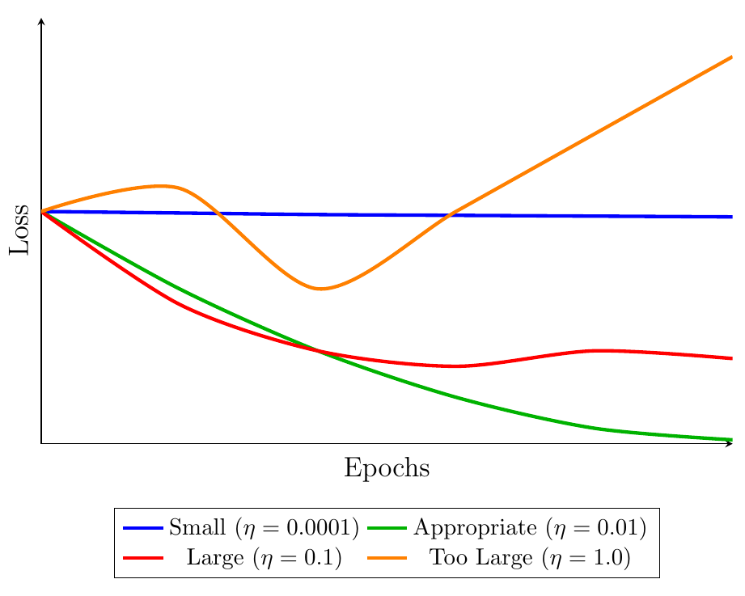
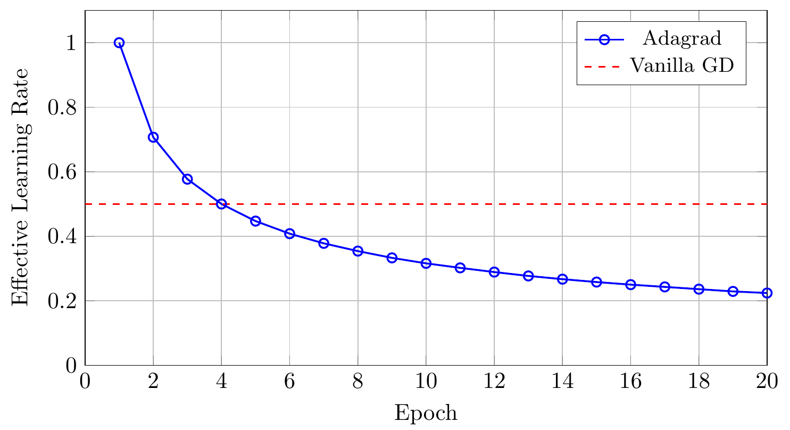
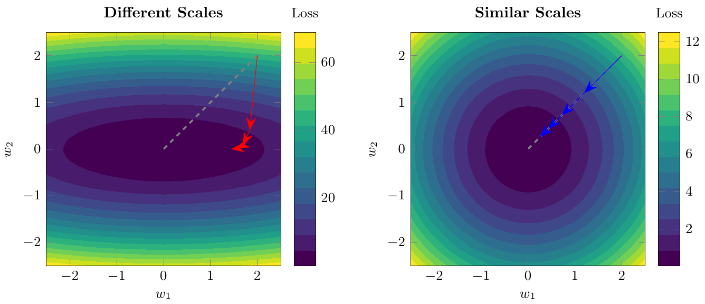

# Lecture 3: Gradient Descent

---

### 1. Gradient

#### 1.1 What is a Gradient?
- A gradient is a **vector** indicating the direction of the steepest increase of a function.
- It is essentially the derivative of a multivariable function.
- Gradient of a function \( f(x) \) at point \( x \) is denoted as \( \nabla f(x) \).

#### 1.2 Evaluating Gradient Descent Efficiency
- Evaluate efficiency by plotting the **Loss vs. Epoch** graph.
- Aim: Identify an appropriate learning rate \( \eta \) for convergence.

---

### 2. Tips for Gradient Descent

#### 2.1 Tuning the Learning Rate

- **Adaptive Learning Rate**:
  - Reduce the learning rate over time for better convergence.
  - Example: \( 1/t \) decay:
  $$
  \eta^{(t)} = \frac{\eta_0}{t + 1}
  $$

- **Adagrad** (**Ada**ptive **Grad**ient):
  - Adjust learning rate individually for each parameter:
  $$
  W^{(t+1)} = W^{(t)} - \frac{\eta_0}{\sqrt{\sum_{i=1}^t (\nabla L(W^{(i)}))^2}} \nabla L(W^{(t)})
  $$

- **Comparison**:
  - **Vanilla Gradient Descent**:
  $$ W^{(t+1)} = W^{(t)} - \eta \nabla L(W^{(t)}) $$
  - **Adagrad** adjusts step sizes dynamically, facilitating faster convergence.
- **Why Adagrad works?**
  - Optimal step size for a single-variable quadratic function:
  $$
  |x_0 + \frac{b}{2a}| = \frac{|2ax_0 + b|}{2a} = \frac{f'(x)|_{x=x_0}}{f''(x)|_{x=x_0}}
  $$
  - Thus, best step size is proportional to the first derivative and inversely proportional to the second derivative.
  - Adagrad approximates this by adjusting the learning rate based on historical gradients.
- **Visualization of Effective Learning Rates**:
The following plot illustrates how Adagrad dynamically reduces the effective learning rate, compared to the fixed learning rate of Vanilla Gradient Descent.

#### 2.2 Stochastic Gradient Descent (SGD)

- SGD computes gradients using a randomly selected subset or a single data point, significantly reducing computation:
$$
\theta^{(t+1)} = \theta^{(t)} - \eta \nabla L^{(i)}(\theta^{(t)})
$$

#### 2.3 Feature Scaling

- Standardize feature ranges to improve gradient descent convergence.
- **Goal**: Equalize feature scales to prevent skewed gradients.
- Example:
  - Without scaling: contour ellipse, uneven gradients.
  - With scaling: circular contours, efficient gradient descent.

- **Method (Standardization)**:
$$
\mu_j = \frac{1}{R}\sum_{r=1}^{R} x_j^{(r)}, \quad \sigma_j = \sqrt{\frac{1}{R}\sum_{r=1}^{R}(x_j^{(r)} - \mu_j)^2}
$$
$$
x_j^{(r)} = \frac{x_j^{(r)} - \mu_j}{\sigma_j}
$$

---

### 3. Gradient Descent Theory

#### 3.1 Optimization Problem
- Goal: Find a local or global minimum of function \( f(x) \).

#### 3.2 Taylor Series

- **Single-variable**:
$$
f(x) \approx f(x_0) + f'(x_0)(x - x_0)
$$

- **Multivariable**:
$$
f(x, y) \approx f(x_0, y_0) + \frac{\partial f}{\partial x}\bigg|_{x_0}(x - x_0) + \frac{\partial f}{\partial y}\bigg|_{y_0}(y - y_0)
$$

- **Gradient Descent Approximation**:
  - For a sufficiently small learning rate \(\eta\):
$$
\theta_1 = \theta_0 - \eta \nabla L(\theta_0)
$$

---

### 4. Limitations of Gradient Descent

- May get trapped in local minima or saddle points (rarely problematic in practice).
- Real challenge: Difficult to confirm whether the global minimum is reached.

---

