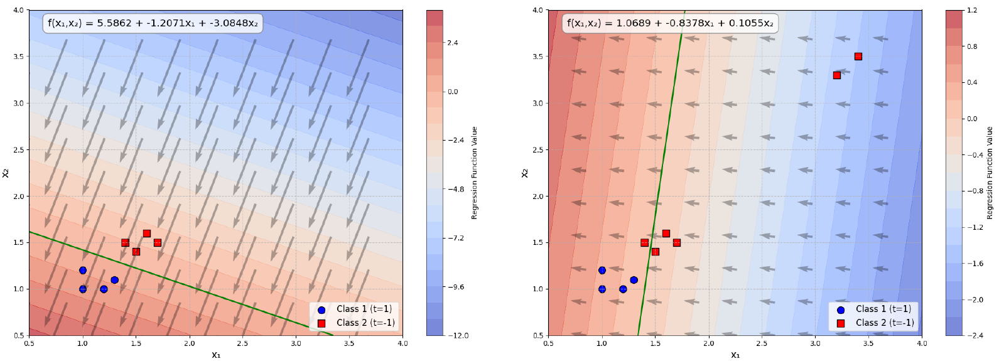

# Lecture 4: Classification
---

### 1. Introduction 
- The other field that machine learning wants to solve is **classification**.
- **Goal**: To find a function with input $x$ and output what class $x$ belongs to.
---
### 2. Can we use regression to solve classification problems?
- Take binary classification for example *(The source code is in ./tex/04/visualize_regression.py)*:

The regression line is very sensitive to outliers and it mightly not be a good choice.
  - **Hidden Worry**:
  If we use regression to solve a **multiclass** classification problem, we need to define classes to be 1, 2, 3, 4, .... This implies that data of class 3 is closer to data of class 2 than data of class 1. However, if the data don't have these relationships, the result will be very bad.
---
### 3. Idea Alternatives
  - Three steps:
    1. **Well-define a Model**: 
      - For regression, the output of the model is a real number.
      - For classification, the output of the model is descrete.
      - Take binary classification for example:
        - $g(x)$ is the model.
        if $g(x) \gt 0$, then $x$ belongs to class 1.
        else $x$ belongs to class 2.

    2. **Loss Function**:
      - For classification, we need to define a loss function as the number of times that the model (function $f$) predicts wrong.
      \[
      L(f) = \sum_{i=1}^{n} \delta(f(x_i) \neq \hat{y}_i)
      \]
    3. **Find the Best Model**:
      - Since we cannot find the derivative of the loss function, we cannot use gradient descent to find the best model.
      - The usual method are preceptron and SVM.
      - But we're not going to cover them here.
---
### 4. Classification in perspective of Probability Theory
#### 4.1 Example: Binary Classification
- The probability of a sample $S$ belongs to class 1, according to Baye's theorem:
\[
P(C_1|x) = \frac{P(S|C_1)P(C_1)}{P(S)}
\]
where $P(C_1)$ is the prior probability of class 1, $P(S|C_1)$ is the likelihood of $x$ given class 1, and $P(S)$ is the marginal probability of $S$. 
Essentially, $P(S)$ is the probability of $x$ belongs to either class 1 or class 2, which is $P(S|C_1)P(C_1) + P(x|C_2)P(C_2)$
- How to define feature of each sample?
  - Represent each sample as a vector. The length of the vector is the number of features.
  - For example, if we have 3 features, then the vector is $(x_1, x_2, x_3)$.
- Assume that the samples are governed by gaussian distribution, thus any sample has a value of probability to belong to class 1 or class 2, which is $P(S|C_1)$ or $P(S|C_2)$.
- Unseen data can also be represented as a vector and we can calculate the probability of it belongs to class 1 or class 2 as well.
##### 4.1.1 Gussian Distribution
\[
f_{\mu, \Sigma}(x) = \frac{1}{(2\pi)^{\frac{d}{2}}} \frac{1}{|\Sigma|^{\frac{1}{2}}} e^{-\frac{1}{2}(x-\mu)^T\Sigma^{-1}(x-\mu)}
\]
where $\mu$ is the mean vector and $\Sigma$ is the covariance matrix.
Input x and output the probability of sampling x.
##### 4.1.2 How to find the Gaussian? (how to determine $\mu$ and $\Sigma$?)
  - **Maximum Likelihood Estimation (MLE)**:
    - Although in principle, we can use any Gaussion to generate the data, but they are in the different likelihood.
    - We want to find the Gaussion that has the highest likelihood to generate the data.
    - The likelihook:
\[
L(\mu, \Sigma) = \prod_{i=1}^{n} f_{\mu, \Sigma}(x_i)
\]
  - Goal: find $\mu^*$ and $\Sigma^*$ that maximize $L(\mu, \Sigma)$.
  - Solution:
  \[
  \mu^* = \frac{1}{N} \sum_{i=1}^{N} x_i
  \]
  from $\mu^*$, we can get $\Sigma^*$:
  \[
  \Sigma^* = \frac{1}{N} \sum_{i=1}^{N} (x_i - \mu^*) (x_i - \mu^*)^T
  \]