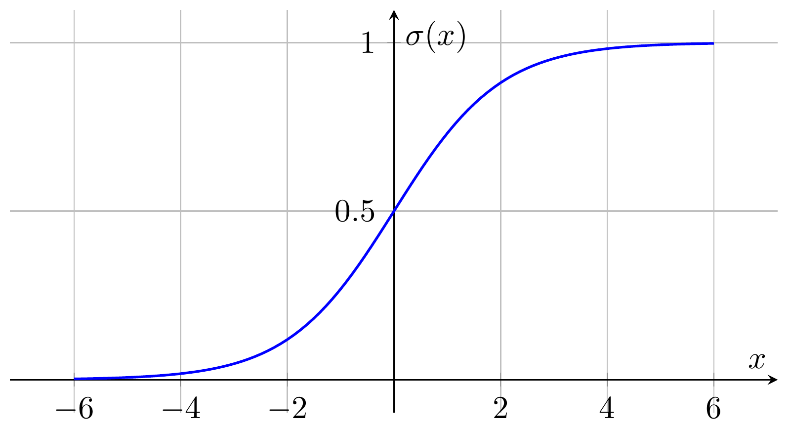

# Lecture 4: Classification
---

### 1. Introduction
- Another essential task in machine learning is **classification**.
- **Goal**: Find a function that maps an input sample to its respective class.

---

### 2. Can Regression Solve Classification Problems?
- Consider binary classification *(see source: `./tex/04/visualize_regression.py`)*:

- **Issues**:
  - Regression is sensitive to outliers, making it unsuitable for classification.
  - **Hidden Worry**: Using regression for multiclass classification implicitly assumes **numerical order among classes** (e.g., class 3 is closer to class 2 than class 1). Without such relationships, regression fails significantly.

---

### 3. Alternative Approach
- Three-step approach:

1. **Clearly Define a Model**:
   - Regression: output is continuous.
   - Classification: output is discrete.
   - Example (Binary Classification):
     - Model: $g(x)$.
     - If $g(x) > 0$, class is $C_1$, else class is $C_2$.

2. **Loss Function**:
   - Defined as the count of misclassifications by model $f$:
     $$
     L(f) = \sum_{i=1}^{n} \delta(f(x_i) \neq \hat{y}_i)
     $$

3. **Find the Best Model**:
   - Loss is non-differentiable, preventing gradient descent.
   - Common methods: Perceptron, SVM (not covered here).

---

### 4. Classification from a Probability Perspective
#### 4.1 Binary Classification (Bayes' Theorem)
- Probability of sample $s$ belonging to class $C_1$:
$$
P(C_1|s) = \frac{P(s|C_1)P(C_1)}{P(s)}
$$
- Marginal probability:
$$
P(s) = P(s|C_1)P(C_1) + P(s|C_2)P(C_2)
$$

- Samples represented as feature vectors $x = (x_1, x_2, \dots, x_d)$.

- Assume Gaussian distribution governs the data:
$$
f_{\mu, \Sigma}(x) = \frac{1}{(2\pi)^{\frac{d}{2}} |\Sigma|^{\frac{1}{2}}} e^{-\frac{1}{2}(x-\mu)^T\Sigma^{-1}(x-\mu)}
$$

#### 4.1.1 Finding Gaussian Parameters
- **Maximum Likelihood Estimation (MLE)**:
$$
L(\mu, \Sigma) = \prod_{i=1}^{n} f_{\mu, \Sigma}(x_i)
$$
- Optimal parameters:
$$
\mu^* = \frac{1}{N} \sum_{i=1}^{N} x_i
$$
$$
\Sigma^* = \frac{1}{N} \sum_{i=1}^{N}(x_i - \mu^*)(x_i - \mu^*)^T
$$

- To prevent overfitting (large covariance matrices), use a shared covariance matrix among classes (Linear Model):
$$
\Sigma^* = \frac{n^{(1)}}{n^{(1)}+n^{(2)}}\Sigma^{(1)} + \frac{n^{(2)}}{n^{(1)}+n^{(2)}}\Sigma^{(2)}
$$

---

### 5. Summary of Probabilistic Models
1. **Model Definition**:
$$
P(C_1|s) = \frac{P(s|C_1)P(C_1)}{P(s|C_1)P(C_1) + P(s|C_2)P(C_2)}
$$
- Parameters: priors $P(C_1), P(C_2)$ and likelihoods $P(s|C_1), P(s|C_2)$.
- Decision: if $P(C_1|s) > 0.5$, classify as $C_1$; else classify as $C_2$.

2. **Model Evaluation**:
   - Maximum likelihood estimation for means $\mu$ and covariance $\Sigma$.

3. **Optimal Model Finding**:
   - Utilize MLE.

---

### 6. Naive Bayes Classifier
- Assumes independence of features:
$$
P(C_1|s) = \prod_{i=1}^{d}P(x_i|C_1)
$$
- Each $P(x_i|C_1)$ is a one-dimensional Gaussian.
- Covariance simplifies to diagonal form.
- **Caution**: Large bias if independence assumption fails.

---

### 7. Posterior Probability and Sigmoid Function
- Posterior probability:
$$
P(C_1|s) = \frac{1}{1 + \frac{P(s|C_2)P(C_2)}{P(s|C_1)P(C_1)}}
$$
Define:
$$
z = \ln\left(\frac{P(s|C_1)P(C_1)}{P(s|C_2)P(C_2)}\right)
$$
Then:
$$
P(C_1|s) = \sigma(z) = \frac{1}{1 + e^{-z}}
$$

- Analyze $z$ further:
$$
z = \ln\frac{P(s|C_1)}{P(s|C_2)} + \ln\frac{P(C_1)}{P(C_2)}
$$
- Using Gaussian assumption and shared covariance $\Sigma$:
$$
z = (\mu^{(1)} - \mu^{(2)})^T\Sigma^{-1}x - \frac{1}{2}(\mu^{(a1)})^T\Sigma^{-1}\mu^{(1)} + \frac{1}{2}(\mu^{(2)})^T\Sigma^{-1}\mu^{(2)} + \ln\frac{n^{(1)}}{n^{(2)}}
$$
Set:
$$
w^T = (\mu^{(1)} - \mu^{(2)})^T\Sigma^{-1}, \quad b = -\frac{1}{2}(\mu^{(1)})^T\Sigma^{-1}\mu^{(1)} + \frac{1}{2}(\mu^{(2)})^T\Sigma^{-1}\mu^{(2)} + \ln\frac{n^{(1)}}{n^{(2)}}
$$
Thus:
$$
P(C_1|s) = \sigma(w^T x + b)
$$
- In generative models: estimate $\mu^{(1)}, \mu^{(2)}, \Sigma, n^{(1)}, n^{(2)}$.
- In discriminative models: directly estimate parameters $w, b$.

---

### Appendix: Quadratic Discriminant Analysis (QDA)
- In the previous section, we assumed the covariance matrices were identical. The approach is known as Linear Discriminant Analysis (LDA).
- In this section, we derive the expression for \(z\) when the covariance matrices \(\Sigma^{(1)}\) and \(\Sigma^{(2)}\) are distinct:

$$
z 
= -\frac{1}{2} 
  \,x^T 
  \Bigl[(\Sigma^{(1)})^{-1} - (\Sigma^{(2)})^{-1}\Bigr]
  x
\;+\;
\Bigl[(\mu^{(1)})^T(\Sigma^{(1)})^{-1} - (\mu^{(2)})^T(\Sigma^{(2)})^{-1}\Bigr]
x
\;+\;
\frac{1}{2} \ln \frac{|\Sigma^{(2)}|}{|\Sigma^{(1)}|}
\;-\;
\frac{1}{2}
  \Bigl[
    (\mu^{(1)})^T(\Sigma^{(1)})^{-1}(\mu^{(1)}) 
    \;-\; 
    (\mu^{(2)})^T(\Sigma^{(2)})^{-1}(\mu^{(2)})
  \Bigr]
\;+\;
\ln \frac{n^{(1)}}{n^{(2)}}.
$$

Which can be written in quadratic form as:
$$
z = x^T A\,x \;+\; b^T x \;+\; c,
$$
for appropriately defined \(A\), \(b\), and \(c\).